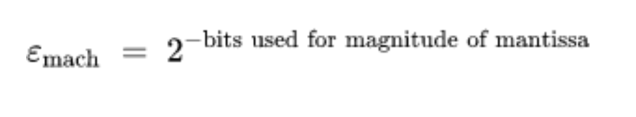
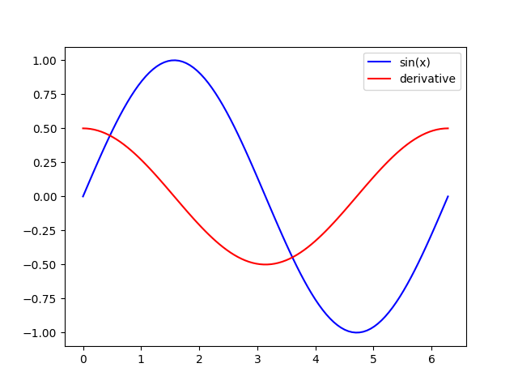
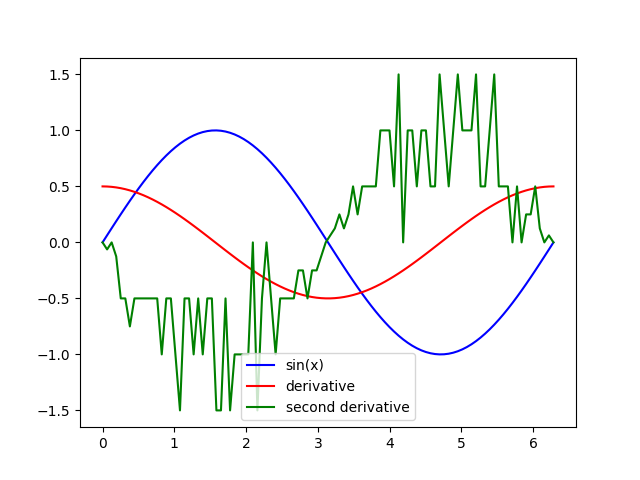
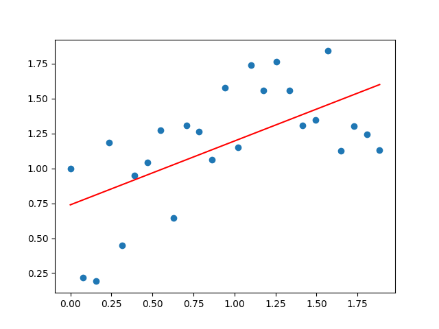
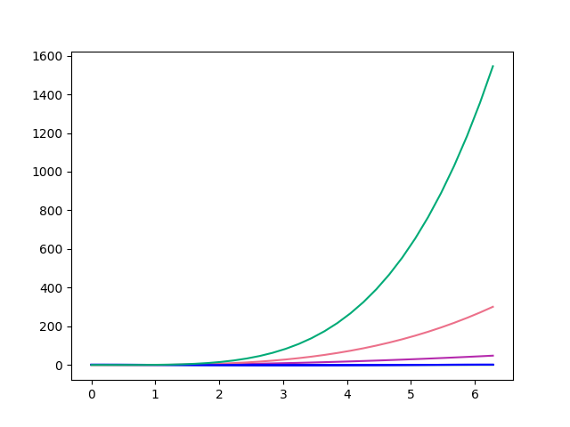
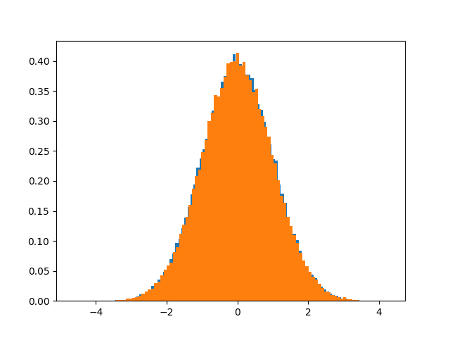

# Opt-Sim-Py

Repositório para a disciplina de otimização e simulação.

Nota: Trabalhos e 2 projetos (em grupo)

> O problema escolhe a linguagem, não vocês - Peretta
>

## Calculo Numérico

Como o computador faz cálculos?

- Ponto Flutuante, [IEEE 754](https://www.h-schmidt.net/FloatConverter/IEEE754.html)


Mantissa → Coeficiente do 2 é negativo (primeiro bit é 2⁻¹ até 2⁻²³)

Expoente → Coeficiente do 2 é positivo (primeiro bit é 2⁸ até 2⁰)

### Épsilon de Máquina



### Derivada Numérica

```jsx
import numpy as np
import matplotlib.pyplot as plt

def dfdt(f,t):
	h = 2**-36
	return(f(t+h) - f(t-h))/(2*h)

t = np.linspace(0,2*np*pi, 100)
fun = lambda t : np.sin(t)
plt.plot(t,fun(t), 'b', label='seno')
plt.plot(t,dfdt(fun,t)), 'b', label='cosseno')
plt.legend()
plt.show()
```
---
## Trabalho 01 - First Exercise

first derivative
dfdt(f,t) = (f(t+h) - f(t-h))/(2*h)


second derivative
d²/dt² f(t) = d/dt(d/dt f(t))

d/dt sin = cos



---
## Trabalho 02 - Second Exercise
- Least squares problem
  
- Linear solving of systems
- Polynomial Interpolation
  
---
## Trabalho 03 - Third Exercise
- LP Problem of optimization

### Results:
```Status: Optimal
Number_of_employees_that_work_on_monday = 8.0
Number_of_employees_that_work_on_tuesday = 0.0
Number_of_employees_that_work_on_wednesday = 3.0
Number_of_employees_that_work_on_thursday = 5.0
Number_of_employees_that_work_on_friday = 2.0
Number_of_employees_that_work_on_saturday = 3.0
Number_of_employees_that_work_on_sunday = 2.0
Total Number of Employees =  23.0
```

---

## Diferenças Finitas
- Wikipedia: [Finite difference](https://en.wikipedia.org/wiki/Finite_difference)

## Aleatoriedade
- Imprevisibilidade
- Retorno à média (Central Limit Theorem) - [Wikipedia](https://en.wikipedia.org/wiki/Central_limit_theorem)
- É possível identificar uma distribuição de probabilidade
- Distribuição normal (Gaussiana) - [Wikipedia](https://en.wikipedia.org/wiki/Normal_distribution)
- LCG (Linear Congruential Generator) - [Wikipedia](https://en.wikipedia.org/wiki/Linear_congruential_generator)
- Mersenne Twister - [Wikipedia](https://en.wikipedia.org/wiki/Mersenne_Twister)
- [Random.org](https://www.random.org/)
- Box-Muller - [Wikipedia](https://en.wikipedia.org/wiki/Box%E2%80%93Muller_transform)
- Big Crunch - [Wikipedia](https://en.wikipedia.org/wiki/Big_Crunch)

### Box-muller Exercise



## Monte Carlo

- [Wikipedia](https://en.wikipedia.org/wiki/Monte_Carlo_method)